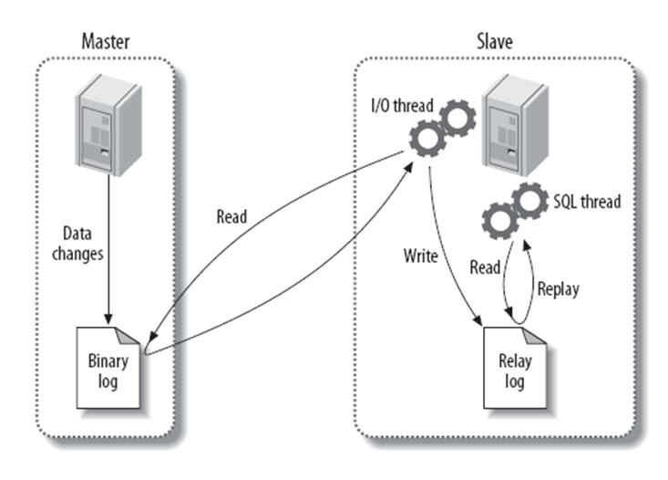

# 关于MySQL面试总结

## 1.异步复制

MySQL复制有两种形式：一种基于二进制日志文件位置，另一种基于`GTID`；而二进制又分为基于行和基于语句复制：
* 基于语句：
  * 数据量小；易于查看；适应性强；
  * 有些语句无法做精确复制；无法对使用了触发器、存储过程等代码的应用实现精确复制；

* 基于行：
  * 能够精确完成有着触发器、存储过程等代码场景中的复制；能完成几乎所有的复制功能；较少的CPU占用率；
  * 无法判断执行了什么样的SQL语句；数据量可能略大；

### 1.1 异步复制
**实现原理**


binlog dump: 将`IO thread`请求的事件发送给对方；
IO thread: 向主服务请求二进制日志中的事件；
SQL thread：从中继日志读取事件并在本地执行；
  

### 1.2 配置过程
**主服务器操作**
* 1.改server-id
* 2.启用二进制日志
* 3.创建有复制权限的帐号

```shel
[mysqld] 
server-id = 11121429
binlog_format = row
log_bin = /datalog/mysql/binlog/mysql-bin.log
expire_logs_days = 14
```

在主库创建复制账号：
```shell
mysql> CREATE USER 'repl'@'11.12.14.30' IDENTIFIED BY 'rpl';
mysql> GRANT REPLICATION SLAVE ON *.* TO 'repl'@'11.12.14.30';
mysql> flush privileges;
```
备份主库：
```shell
$ mysqldump -S /data/mysql/data/mysql.sock -usystem -p --all-databases --master-data=2 --set-gtid-purged=off   --triggers --events --routines> /tmp/dumpmaster.sql
```

**从服务器操作**
* 1.改server-id
* 2.启用中继日志
* 3.连接主服务器
* 4.启动复制线程

```shell
[mysqld] 
server-id = 11121430
binlog_format = row
log_bin = /datalog/mysql/binlog/mysql-bin.log
expire_logs_days = 14
read_only=1
```

导入备份：
```shell
$ mysql -S /data/mysql/data/mysql.sock -usystem -p </tmp/dumpmaster.sql
```

创建复制账号：
```shell
mysql> CREATE USER 'repl'@'11.12.14.29' IDENTIFIED BY 'rpl';
mysql> GRANT REPLICATION SLAVE ON *.* TO 'repl'@'11.12.14.29';
mysql>flush privileges;
```
启动同步
```shell
mysql> CHANGE MASTER TO MASTER_HOST = '11.12.14.29', MASTER_USER='repl', MASTER_PASSWORD='rpl', master_log_file='mysql-bin.000001',master_log_pos= 10843699;
```

## 2.半同步复制
复制实际上是异步的复制，主库将二进制日志发送到从库后并不需要确认从库是否接受并应用，这时就可能会造成数据丢失。`MySQL` 从`5.5`版本后推出了半同步的功能，相当于`Oracle DG`的最大保护模式，它要求从库在接收并应用日志后，主库才提交完成，保证了数据。

开启半同步需要满足如下要求：
* MySQL 5.5及以上版本
* 变量have_dynamic_loading为YES
* 异步复制已经存在

### 2.1 加载半同步插件
主库和从库
```shell
mysql> INSTALL PLUGIN rpl_semi_sync_master SONAME 'semisync_master.so';
mysql> INSTALL PLUGIN rpl_semi_sync_slave SONAME 'semisync_slave.so';
```
确认是否加载成功
```shell
mysql> show plugins;
mysql> SELECT PLUGIN_NAME, PLUGIN_STATUS FROM INFORMATION_SCHEMA.PLUGINS WHERE PLUGIN_NAME LIKE '%semi%';
```
### 2.2 启用半同步
首先启用半同步插件

主库
```shell
mysql> SET GLOBAL rpl_semi_sync_master_enabled = 1;
```
从库
```shell
mysql> SET GLOBAL rpl_semi_sync_slave_enabled = 1;
```
需要重启IO线程才能使半同步生效，也可直接重启复制。
```shell
mysql> STOP SLAVE IO_THREAD;
mysql> START SLAVE IO_THREAD;
```
如果从库超过一定时间不能和主库进行通信，则会自动降为异步模式。该时间由rpl_semi_sync_master_timeout参数控制，单位为毫秒。

查看半同步状态
```shell
# 主库
mysql> show status like 'Rpl_semi_sync_master_status';
mysql> show status like 'Rpl_semi_sync_slave_status';

# 从库
mysql> show status like 'Rpl_semi_sync_slave_status';
mysql> show status like 'Rpl_semi_sync_master_status';
```
主库的`master`和从库的`slave`都需要为`ON`。

### 2.3 写入配置文件
主库和从库
```shell
plugin_dir = /usr/local/mysql/lib/plugin
plugin_load = "rpl_semi_sync_master=semisync_master.so;rpl_semi_sync_slave=semisync_slave.so"
rpl_semi_sync_master_enabled = 1
rpl_semi_sync_slave_enabled = 1
rpl_semi_sync_master_timeout = 5000
```

## 3. GTID复制

### 3.1 GTID 简介
`GTID`是`MySQL`数据库每次提交事务后生成的一个全局事务标识符，`GTID`不仅在本服务器上是唯一的，其在复制拓扑中也是唯一的。每当一个客户端事务在服务端提交，该事务会被写入二进制文件同时会被分配一个新的`GTID`。同时保证每个GTID之间是连续的，不会有GAP。

如果客户端事务没有被写入二进制文件(如事务被过滤出去或者是只读的)，则不会被分配`GTID`。`GTID`的`auto-skip`特性意味着在主库上执行过的事务不会在从库上执行超过一次。

如果一个`GTID`被提交了，任何相同的GTID的执行请求会被忽略，并且不会报错。如果一个`GTID`的事务执行了，但没有被提交或回滚，则任何相同`GTID`的事务都会被阻塞，如果这时事务回滚了，则会执行该事务，如提交了则跳过该事务。

**GTID格式**

`GTID`的表现形式如下面：
```shell
GTID = source_id:transaction_id
```
其中`source_id`一般为数据库的`uuid`，`transaction_id`为事务`ID`，从1开始。例如：
```shell
3E11FA47-71CA-11E1-9E33-C80AA9429562:23
```
如上面的`GTID`可以看出该事务为`UUID`为`3E11FA47-71CA-11E1-9E33-C80AA9429562`的数据库的23号事务。

### 3.2 GTID集合
`GTID`集合为多个单`GTID`和一个范围内`GTID`的集合，他主要用于如下地方：

* gtid_executed 系统变量；
* gtid_purged系统变量；
* GTID_SUBSET() 和 GTID_SUBTRACT()函数；

他的格式如下：
```shell
3E11FA47-71CA-11E1-9E33-C80AA9429562:1-5          # 它代表uuid为3E11FA47-71CA-11E1-9E33-C80AA9429562的服务器的1到5号事务;
3E11FA47-71CA-11E1-9E33-C80AA9429562:1-3:11:47-49 # 代表该服务器的1到3号，11号和47到49号事务;
```

### 3.3 mysql.gtid_executed表
`gtid_executed`表，它位于`MySQL`的`mysql`数据库中。该表使得从库可以在不开启二进制日志的时候仍然可以使用`GTID`来进行复制以及在二进制日志文件丢失时获得`GTID`的状态，他会被`reset master`命令重置。

但需要注意的是复制环境中主库必须要开启二进制日志。只有当`gtid_mode`为`ON`或`ON_PERMISSIVE`时才会将执行过的`gtid`写到`gtid_executed`表中。

当二进制日志开启时，每当日志文件轮转或数据库关闭时，服务器才会将日志中的`GTID`写到`gtid_executed`表中。如果数据库发生异常时，服务器会在做恢复时将二进制文件中的`gtid`写到`gtid_excuted`表中。

由于该表会记录每次的提交事务，久而久之会变的非常大，这时服务器会定时的将一些各个`GTID`合并成一个`GTID Set`。频率由`gtid_executed_compression_period`系统变量决定，默认值为 1000，代表每有 1000 个`GTID`会压缩一次，将其设置为0代表禁用该功能。它由`thread/sql/compress_gtid_table`前台进程完成，并不会出现在`SHOW PROCESSLIST`命令中。

**提示：** 请记住`gtid_executed`表和`gtid_executed`系统变量的区别，当二进制文件被启用时，`gtid_executed`表保存的并不是全部的被执行过的`gtid`，这时我们需要查询`gtid_executed`系统变量，他会在每次事务提交后更新。

### 3.4 gtid 生命周期

#### 3.4.1 主库提交事务被分配GTID
当主库执行和提交一个事务后，该事务会被分配一个`GTID`(主库`uuid`和最小的未被使用过的事务号)，之后会被写入到二进制日志文件中，其位置在具体事务之前。

如果一个事务没有被写入二进制文件，例如被过滤掉或者是只读的，则不会被分配`GTID`。

#### 3.4.2 主库GTID写入二进制文件
分配`GTID`后，该`GTID`会在提交的时候以`Gtid_log_event`事件的形式写入二进制日志文件中，其位置在具体事务之前。

当日志发生切换或者数据库关闭时该`GTID`会被写入到`mysql.gtid_executed`表中。此时我们可以通过`mysqlbinlog`命令查看。

#### 3.4.3 主库写入到GLOBAL.gtid_executed系统变量中
在提交时，还会将该`GTID`加入到`GLOBAL.gtid_executed`系统变量中。该变量是个`GTID`集合，代表目前为止所有被执行过的事务，主要用于复制中。我们也可以通过`show master status`命令查看。

#### 3.4.4 从库接收主库GTID事务
当二进制日志被传输到备库后，会被储存在`relay`日志中，从库会读取该`GTID`并设置`gtid_next`变量为该`GTID`。这样就告诉备库下一个执行的事务必须为该`GTID`,需要注意的是该变量是`session`级别的。

#### 3.4.5 从库应用主库GTID事务
在接收到主库`GTID`事务并设置好`gtid_next`后，如果没有其他进程在执行的话，从库执行该`GTID`事务。

如果同时有多个进程执行该事务，则会选择其中一个(如多线程复制)，我们可以执行`select @@GLOBAL.gtid_owned`命令查询`gtid_owned`系统变量来确认。

由于该事务已经被主库分配了`GTID`，所以从库上的该事务不会被分配`GTID`，而是使用`gtid_next`变量的值。

#### 3.4.6 从库写入二进制文件日志
由于从库重新执行了来自主库的事务，所以他也会写日志到从库的二进制日志文件中。这里需要考虑到两种情况：
* 如果从库启用了二进制日志功能，则和1.2步骤一致；
* 如果从库未启用二进制日志功能，则会将`gtid`和对应的事务语句写入到`mysql.gtid_executed`表中；

需要注意的是如果未开启二进制日志功能`MySQL 5.7`及之前只有`DML`操作是原子级别的，`DDL`并不是，意味着如果`MySQL`发生异常，数据可能会变得不一致（MySQL 8.0后所有操作都支持）。

#### 3.4.7 从库写入到GLOBAL.gtid_executed系统变量中
同样的在提交后，从库也会将该`GTID`写入到从库的`gtid_executed`系统变量中。

### 3.5 关于GITD复制的限制

由于其是基于事务的，有一些特性可能不受支持，主要如下：
* update语句中引用了非事务型的表；
* CREATE TABLE ... SELECT 语句；
* 临时表；
* sql_slave_skip_counter；
* mysql_upgrade