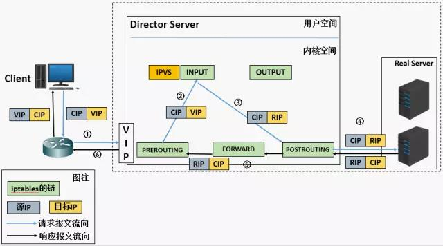

# LVS 负载均衡原理及安装配置

---

lvs 是 `Linux Virtual Server` 的简称，也就是 linux虚拟服务器, 是一个由章文嵩博士发起的自由软件项目，它的官方站点是 `www.linuxvirtualserver.org` 。现在 lvs 已经是 linux 标准内核的一部分，在 linux2.4 内核以前，使用 lvs 时必须要重新编译内核以支持LVS功能模块，但是从 linux2.4 内核以后，已经完全内置了 lvs 的各个功能模块，无需给内核打任何补丁，可以直接使用 lvs 提供的各种功能。

## lvs 组成及相关术语
**lvs 组成** 
`lvs` 由2部分程序组成，包括 ipvs 和 ipvsadm；
 * ipvs(ip virtual server)：一段代码工作在内核空间，叫 ipvs，是真正生效实现调度的代码；
 * ipvsadm：另外一段是工作在用户空间，叫 ipvsadm，负责为ipvs内核框架编写规则，定义谁是集群服务，而谁是后端真实的服务器 (Real Server)；

**lvs相关术语**
 > * DS：Director Server。指的是前端负载均衡器节点。
 > * RS：Real Server。后端真实的工作服务器。
 > * VIP：向外部直接面向用户请求，作为用户请求的目标的IP地址。
 > * DIP：Director Server IP，主要用于和内部主机通讯的IP地址。
 > * RIP：Real Server IP，后端服务器的IP地址。
 > * CIP：Client IP，访问客户端的IP地址。

## lvs 工作模式
**NAT**  

a). 当用户请求到达 Director Server 时，此时请求的数据报文会先到内核空间的PREROUTING链（此时报文的源IP为CIP，目标IP为VIP）；  
PREROUTING检查发现数据包的目标IP是本机，将数据包送至INPUT链；  
b). IPVS比对数据包请求的服务是否为集群服务，若是，修改数据包的目标IP地址为后端服务器IP，然后将数据包发至POSTROUTING链（此时报文的源IP为CIP，目标IP为RIP）；  
c). POSTROUTING 链通过选路，将数据包发送给Real Server。Real Server比对发现目标为自己的IP，开始构建响应报文发回给Director Server（此时报文的源IP为RIP，目标IP为CIP）；  
d). Director Server在响应客户端前，此时会将源IP地址修改为自己的VIP地址，然后响应给客户端（此时报文的源IP为VIP，目标IP为CIP）；  

特性：  
1. RS的应该使用私有地址；  
2. RS的网关必须指向DIP；  
3. RIP和DIP必须在同一网段内；
4. 请求和响应的报文都得经过Director，在高负载场景中，Director很可能成为性能瓶颈；
5. 支持端口映射；  
6. RS可以使用任意支持集群服务的OS；

**DR**  

a). 当用户请求到达Director Server，此时请求的数据报文会先到内核空间的PREROUTING链（此时报文的源IP为CIP，目标IP为VIP）；  
b). PREROUTING检查发现数据包的目标IP是本机，将数据包送至INPUT链；  
c). IPVS比对数据包请求的服务是否为集群服务，若是，将请求报文中的源MAC地址修改为DIP的MAC地址，将目标MAC地址修改RIP的MAC地址，然后将数据包发至POSTROUTING链。 此时的源IP和目的IP均未修改，仅修改了源MAC地址为DIP的MAC地址，目标MAC地址为RIP的MAC地址；  
d). 由于DS和RS在同一个网络中，所以是通过二层来传输。POSTROUTING链检查目标MAC地址为RIP的MAC地址，那么此时数据包将会发至Real Server；  
e). RS发现请求报文的MAC地址是自己的MAC地址，就接收此报文。处理完成之后，将响应报文通过lo接口传送给eth0网卡然后向外发出（此时的源IP地址为VIP，目标IP为CIP）。响应报文最终送达至客户端；  

特性： 
1. RS可以使用私有地址，还可以使用公网地址，此时可以直接通过互联网连入RS，以实现配置、监控等；  
2. 网关一定不能指向DIP；  
3. RS跟Dirctory要在同一物理网络内（不能有路由器分隔）；  
4. 请求报文经过Directory，但响应报文一定不经过Director；  
5. 不支持端口映射；  
6. RS可以使用大多数的操作系统;

**TUN**

即（Virtual Server via IP Tunneling） IP隧道。它的连接调度和管理与VS/NAT方式一样，只是它的报文转发方法不同，VS/TUN方式中，调度器采用IP隧道技术将用户请求转发到某个Real Server，而这个Real Server将直接响应用户的请求，不再经过前端调度器，此外，对Real Server的地域位置没有要求，可以和Director Server位于同一个网段，也可以是独立的一个网络。因此，在TUN方式中，调度器将只处理用户的报文请求，集群系统的吞吐量可以提高到10倍。

特性： 
1. RIP，DIP，VIP都得是公网地址；  
2. RS的网关不会指向也不可能指向DIP；  
3. 请求报文经过Directory，但响应报文一定不经过Director；  
4. 不支持端口映射；  
5. RS的OS必须得支持隧道功能；

## lvs 负载调度算法
静态调度方法：仅根据算法本身进行调度 `rr,wrr,dh,sh`；
动态调度算法：根据算法及RS当前的复制状态 `wlc,lblc,lblcr,SED,NQ`(后两种官方无)；

| 算法   | 说明     |
| ----   | :-----    |
|rr	|轮叫（Round Robin），它将请求依次均等的分配给不同的RS。适合于RS性能相差不大的情况。
|wrr|加权轮叫（Weighted Round Robin）|它将依据不同RS的权值分配任务。权值较高的RS将优先获得任务，并且分配到的连接数将比权值低的RS更多。相同权值得RS得到相同数目的连接数。
|dh	|目标地址散列调度（Destination Hashing），以目的地址为关键字查找一个静态hash表示获得需要的RS。
|sh	|源地址散列调度（Source Destinantion Hashing） 以源地址为关键字查找一个静态hash表示获得需要的RS。(实现会话绑定功能)
|wlc|加权最小连接数调度（Weighted Least-Connection）， 假设各台RS的权值依次为Wi(i=1...n),当前的TCP连接数依次为Ti(i=1...),依次选取Ti/Wi为最小的RS作为下一个分配的RS。计算当前的负载Overhead=（Active*256+Inactive）/weight
|lc	|最小连接数调度（Least-Connection）， IPVS表示存储了所有的活动的链接。把新的链接请求发送到当前连接数最小的RS。计算当前的负载Overhead=Active*256+Inactive来实现,结果最小的胜出；
|lblc|	基于局部性的最少链接（Locality-Based Least-Connection）， 将来自同一目的地址的请求分配给同一台RS，如果这台服务器尚未满负载，否则分配给连接数最小的RS，并以它为下一次分配的首选考虑。
|lblcr|	带复制的基于局部性最少链接（Locality-Based Least-Connection with Replication）， 对于某一目的地址，对应有一个RS子集。对此地址请求，为它分配子集中连接数最小RS。如果子集中所有服务器均已满负荷，则从集群中选择一个连接书较小服务器，将它加入到此子集并分配连接；若一定时间内，未被做任何修改，则将子集中负载最大的节点从子集删除。相当于dh+lc。
|SED| 最短的期望延迟（Shortest Expected Delay Scheduling SEd）计算当前的负载Overhead=（Active+1）*256/weight
|NQ	|最少队列调度（Never Queue Scheduling）
